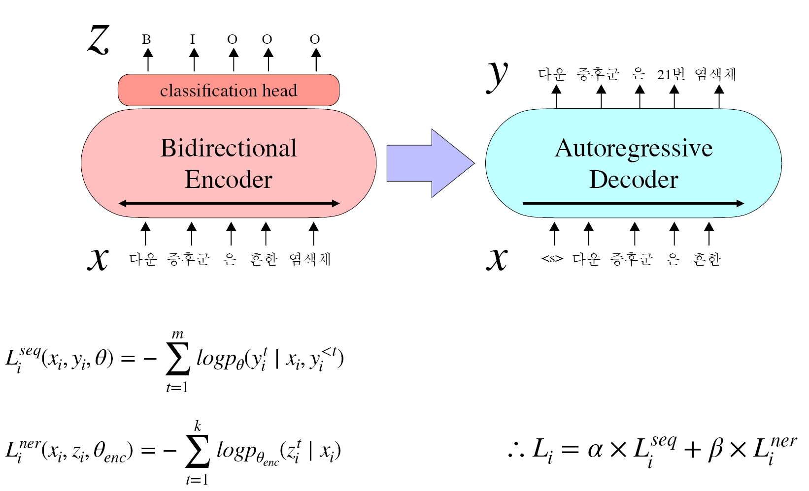

<h1 align="center">Medical Domain Retrieval-Augmented Question Answering through Entity-based Context Extraction</a></h2>

This is the implementation of the following paper:

> **Medical Domain Retrieval-Augmented Question Answering through Entity-based Context Extraction** [[Paper](https://www.dbpia.co.kr/pdf/pdfView.do?nodeId=NODE11861871)]

개체명 기반 컨텍스트 추출을 통한 의료 분야 검색 증강 질의응답 시스템

The overview of training.

This paper was selected as the Best Paper in the computational linguistics category at the Korea Computer Congress 2024.

<a href="/slide/kcc_jeonghuncho.pdf" download>Slides</a> were used for the oral presentation.

## Acknowledgement
The code refers to [facebookresearch/contriever](https://github.com/facebookresearch/contriever).